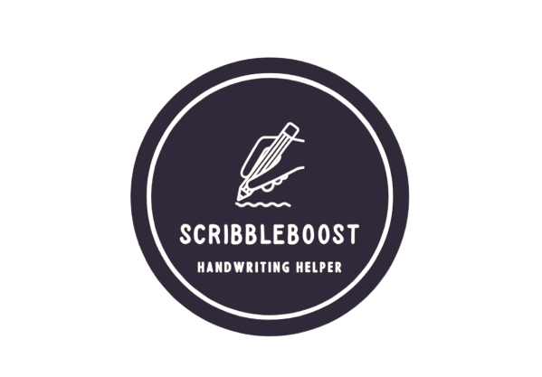

<div align="center">
  
</div>

ScribbleBoost is an academic final project developed by Sender Hodik and Idan Brauner, supervised by Dr. Anat Dahan and Dr. Navit Roth.

Handwriting is an essential skill used in building self-esteem, academic achievement, accessible creativity, artistic opportunities, and daily task. Many children struggle with handwriting despite the fact that it is a necessary skill for academics and other professions. As a result, there are occupational therapists who are skilled in helping children improve their handwriting.

Since technology has advanced, development of advanced digital technologies may offer fresh and newer ideas from the traditional methods like pencil and paper that are no longer efficient enough. 
For occupational therapists treating elementary school-aged children with handwriting difficulties, we developed ScribbleBoost, a web-based program that utilizes graphic tablets to track and improve handwriting skills
With the system, patients can perform writing exercises on the tablet, which are synchronized with what is done on the system's screen, providing positive and negative feedback in real time, while adjusting specific parameters such as marking the line at which the writing begins and the distance between the scribbles of a patient on a page
As part of the system, therapists are able to view and track their patients' progress through a user management interface.

The project has tremendous potential, both from a research perspective where researchers can examine the progress of patients, as well as from a performance perspective where patients, particularly children, can use a user-friendly system to improve their handwriting skills. 


## The following technologies were used

This project uses a variety of technologies to build a full-stack web application. Here's a brief explanation of each one:

Front-end: 
ReactJS is a popular JavaScript library for building user interfaces. It allows developers to create reusable UI components and manage the state of the application efficiently. ReactJS is widely used for building single-page applications and is known for its high performance and ease of use.

UI Framework: 
MaterialUI is a popular React component library that provides pre-built UI components based on Google's Material Design guidelines. It includes a wide range of components such as buttons, forms, cards, and more, that can be easily customized to match the project's design.

Backend: 
NodeJS is a popular JavaScript runtime environment that allows developers to run JavaScript code outside of the browser. It is widely used for building server-side applications, and its event-driven, non-blocking I/O model makes it highly scalable and efficient.

Database: MongoDB is a popular NoSQL database that stores data in JSON-like documents. It is widely used for building scalable, high-performance web applications, and is known for its flexibility and ease of use.


## Getting Started

To get a local copy up and running follow these simple steps.

### Prerequisites

First, npm should be installed

* npm

```sh
npm install npm@latest -g
```

### Installation

1. Clone the repo

```sh
git clone https://github.com/senderh55/enhancing-handwriting-project.git
```
2. In the server folder, create an environment variable file called .env with the following contents:
```sh
MONGODB_URL=<your_mongodb_url>

JWT_SECRET=<your_jwt_secret>

PORT=8000

MAIL_ADDRESS=<your_mail_address>

MAIL_KEY=<your_mail_key>
```

3. Install NPM packages separately in server and client folders
```sh
cd server
npm install
```
```sh
cd client
npm install
```
4. Run the project in each folder using:
```sh
npm start
``` 


## Preview


